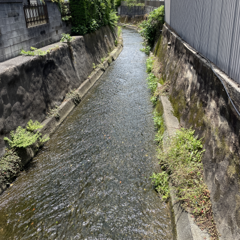
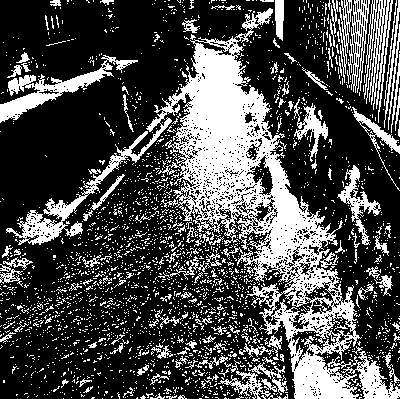
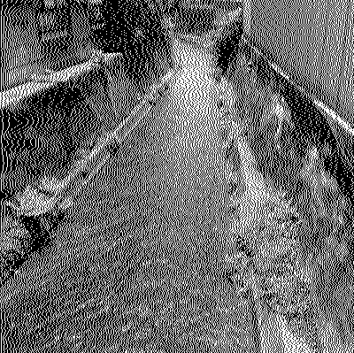
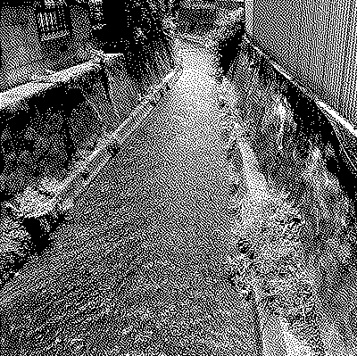

# dithering_py
画像をディザリング（誤差拡散）する例

## 使い方
### uv環境
`uv sync`

### uv環境以外
`.python-version`と`pyproject.toml`を参考にpythonとその依存関係をインストール

### ファイル

- `simple.py`
    - ナイーブな量子化(グレースケールで 0 or 255 に変換)
    
- `right_dithering.py`
    - 誤差を右隣に拡散
    - ナイーブな量子化より自然に見えるが，ところどころ違和感がある
    
- `floyd_steinberg_dithering.py`
    - 誤差を，右隣と左下，下，右下方向にそれぞれ 7/16, 3/16, 5/16, 1/16 の重みをつけて拡散
    - 右隣のみへの拡散と比べて違和感が減少 & 見やすくなった
    
- `atkinson_dithering.py`
    - 誤差を，右と下にそれぞれ2ピクセル，左下と右下にそれぞれ1ピクセル，合計6箇所に 1/8 ずつ重みをつけて拡散 **（2/8 分の誤差は捨てられる）**
    - Floyd-Steinberg Dithering より誤差が大きいが，逆に良い印象を受ける
    